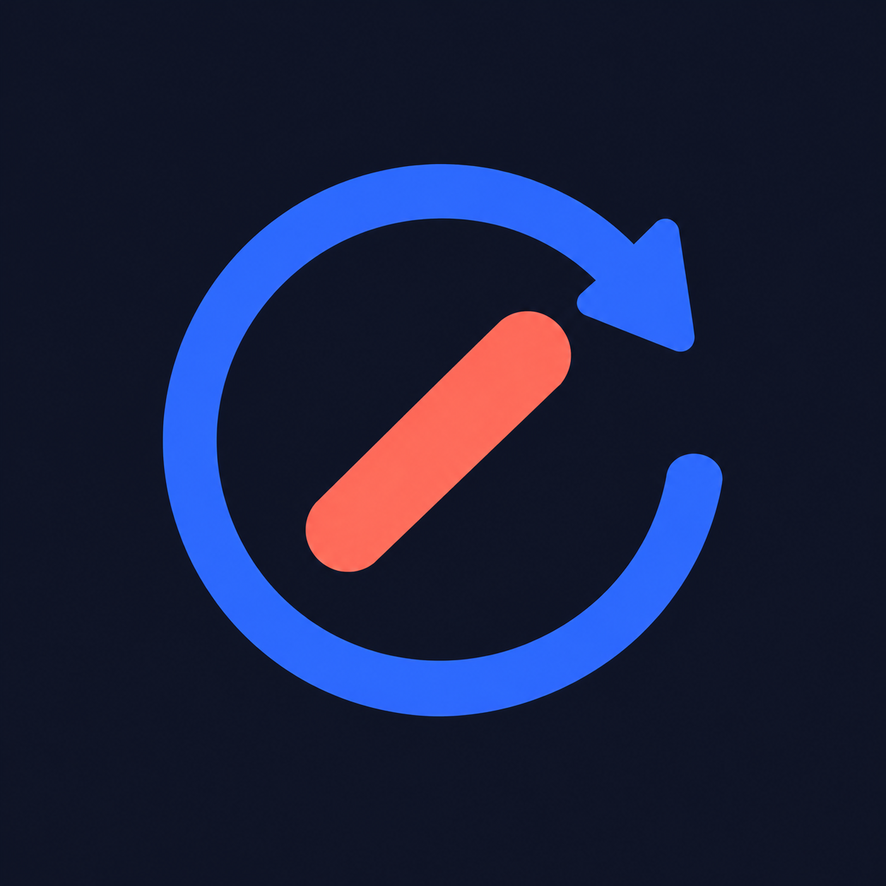

<p align="center">
  
</p>

<h1 align="center">Relay</h1>

<p align="center">
  <b>Your AI agent ran out of usage? Pass the baton.</b><br>
  Another agent keeps working. When your limit resets, the first one wakes up, reviews the work and finishes.
</p>

<p align="center">
  <a href="https://github.com/AeroUp/Relay/actions"></a>
  
  = 20">
  <a href="LICENSE"></a>
</p>

---

You're deep in a task and Claude Code stops with *"You've hit your session limit · resets 3pm"*. Normally the work just sits there until you come back.

**With Relay installed:**

```
Claude hits its limit ──► Relay reads the reset time
                          writes .relay/baton.md from the conversation
                          (request, follow-ups, todo list, files touched, last messages)
Codex picks up the baton ──► keeps working on the task in the background
                             appends "Report from Codex" to the baton
3:01pm, limit resets ──► Claude's own session is resumed with the full context:
                         "[Relay] You're back. While you were out, Codex did…"
                         Claude reviews the diff, fixes what's wrong, finishes the task
```

You get a desktop notification at each step. If Codex runs out too, the next agent in the chain takes over. If you come back to the chat before the reset, Relay adds Codex's progress to your next message instead.

Works with **Claude Code, Codex and Antigravity** (the IDE and the `agy` CLI), using your existing logins and subscriptions. You don't need API keys.

## Install

### Easiest: let your AI agent do it

Paste this into Claude Code, Codex or Antigravity:

```
Set up Relay for me by following https://raw.githubusercontent.com/AeroUp/Relay/main/AGENT_SETUP.md
```

The agent checks the prerequisites, installs Relay, verifies it, and tells you what changed. It follows [AGENT_SETUP.md](AGENT_SETUP.md).

### Manual

You need **Node.js 20+**, and Claude Code plus at least one of: [Codex](https://github.com/openai/codex), [Antigravity](https://antigravity.google) (the `agy` CLI, which replaced Gemini CLI, or the IDE). Log in to each one once before installing.

```bash
git clone https://github.com/AeroUp/Relay.git
cd Relay
node bin/relay.mjs install
```

Then **restart your agents**. To check the setup:

```bash
node bin/relay.mjs doctor
```

<details>
<summary>What <code>install</code> changes</summary>

It backs up every file it touches to `*.bak-relay` first.

- **Claude Code:**
  - Adds the MCP server `relay`.
  - Adds three hooks to `~/.claude/settings.json`:
    - `StopFailure`: relays when Claude stops on a usage limit.
    - `SessionStart`: revives the waker if relays are pending.
    - `UserPromptSubmit`: delivers reports when you come back.
  - Adds the `relay` skill.
- **Codex:** adds a marked MCP block to `~/.codex/config.toml` and the skill in `~/.agents/skills/`.
- **Antigravity (IDE + `agy` CLI):** adds `mcpServers.relay` to `~/.gemini/config/mcp_config.json`, allows `mcp(relay/*)` for headless runs, and adds the skill.
- **A login item**, so relays that are still waiting survive a reboot. This is a hidden Startup script on Windows, a LaunchAgent on macOS, or an XDG autostart entry on Linux. Leave it out with `--no-autostart`.

The config points at the folder you installed from, so keep the clone where it is. If you move it, run `install` again.
</details>

## Three ways to use it

**1. Automatic (Claude Code).** Nothing to do. When a usage limit stops a Claude Code session, Relay takes it from there.

**2. Tag out on purpose (any agent).** Tell your agent "I'm almost out of usage, hand this to codex", or use `/relay`. The agent then:
- writes a proper baton: goal, what's done, what's left, key decisions, how to verify;
- calls the `handoff` tool;
- picks when it comes back to review: after its limit resets, as soon as the partner finishes, or when you next send a message.

**3. Autopilot (terminal).** Start a task with failover built in:

```bash
relay run "add dark mode to the settings page" --chain claude,codex,antigravity --cwd ~/my-app --wait
```

## Watch it live

Every relay streams what the partner is doing: its messages, the commands it runs with their output, files it edits, its plan and its final report.

- **Live viewer.** `relay watch` opens it in your browser. The takeover notification has a **Watch live** button, and when Claude hits its limit, the message Relay leaves in the chat includes the link. In the Claude desktop app you can keep it open in the Browser pane next to your chat. It works for every agent.
- **Codex turns in the ChatGPT app.** When Codex takes over, the notification also has an **Open in ChatGPT** button (or run `relay open`). It opens Codex's thread in the ChatGPT/Codex desktop app, with every step and the final report. The app shows the thread as of when you opened it, so reopen it to refresh. The live viewer updates on its own.
- **On your phone.** The viewer only listens on this PC (`127.0.0.1`). To watch from your phone over Tailscale, run `relay config set viewer_host <your PC's Tailscale IP>`. With a [Discord webhook](#commands) set, the Discord notifications then link to it too.

Headless Claude runs don't show up in the Claude app's session list. Use the live viewer for those, or the viewer's **Copy resume command** to open the session in a terminal.

## Commands

```bash
relay watch [id]             # live viewer in your browser
relay open [id]              # open the current turn in its agent's app (Codex → ChatGPT app)
relay doctor                 # agents, usage limits (Codex shows exact %), waker, relays
relay list                   # recent relays
relay show <id>              # a relay's log + its partner's live output
relay now <id>               # wake the primary agent right away
relay cancel <id>            # stop a relay and its running partner
relay notify --discord <url> # also send notifications to a Discord webhook (reaches your phone)
relay handoff codex --baton notes.md --task "…" --resume after_handoff
relay config set fallback_chain '["codex","antigravity"]'
```

`relay` means `node bin/relay.mjs`. To get a real `relay` command, either run `npm link` inside the clone, or install with `npm i -g github:AeroUp/Relay` and then run `relay install`.

MCP tools: `status`, `handoff`, `relays`.

## Configuration

`relay config set <key> <value>` writes to `~/.relay/config.json`.

| Key | Default | |
|---|---|---|
| `enabled` | `true` | Relay automatically when Claude Code stops on a usage limit |
| `fallback_chain` | `["codex","antigravity","claude"]` | Who takes over, in order |
| `auto_fallback` | `true` | `false` = just wait for the reset and resume, with no partner |
| `on_reset` | `"wait"` | `wait`: let the partner finish, then resume. `takeover`: stop the partner and resume now. `none`: the partner owns the task |
| `default_access` | `"write"` | Access for unattended runs when your session asks before every action (see Safety) |
| `resume_buffer_sec` | `90` | Wait this long after the reset before resuming |
| `transient_retry_min` | `4` | Retry delay for plain 429 / overloaded errors (no handoff) |
| `max_legs` | `8` | Max agent runs per relay |
| `viewer_port` | `7575` | Port for the live viewer. `0` turns it off |
| `viewer_host` | `"127.0.0.1"` | Where the viewer listens. Set it to your Tailscale IP to watch from your phone |

## Safety

- **Unattended runs keep your session's permission level.** Relay maps your session's mode like this:
  - **accept-edits** → `write`: edits in the project. Codex runs `workspace-write` in its sandbox.
  - **bypass-permissions** → `full`.
  - **plan** → `read`.
  - **sessions that ask before every action** → `default_access`, which is `write` unless you change it.
- Partners only get the baton and the project folder. Relay never shares your chat with another service. Each agent runs on its own login.
- **Recursion guard:** agents started by Relay carry `AI_AGENT_DEPTH` and can't spawn agents endlessly.
- **Batons stay out of git.** They live in `<project>/.relay/`, which has its own `.gitignore`.
- Relay only reads rate-limit info that the CLIs already show you: the limit message, Claude's `rate_limit_event` in headless runs, and Codex's own session logs. It never touches your credentials.

## Limits & honest notes

- **Automatic detection is Claude Code only**, through its `StopFailure` hook. When Codex or Antigravity is your main agent, use `handoff` (ask it to "tag out") or `relay run`.
- **A resumed Claude session runs in the background.** Its work goes into the same conversation history. Reopen the session to see it, or just read `.relay/baton.md` and the diff.
- **Antigravity support** follows the official docs but hasn't been battle-tested yet. The `agy` CLI can be a fallback runner. The Antigravity IDE alone can hand off through the MCP tools, but it can't run headless. `gemini` is still accepted as an alias for `antigravity`.
- **Codex on Windows:** if Codex's elevated sandbox can't initialise outside its desktop app, Relay switches Codex to its unelevated sandbox, which is still sandboxed. The choice is stored in `~/.agent-state/codex.json`.

## Pairs well with Tag-Team

**[Tag-Team](https://github.com/AeroUp/Tag-Team)** lets the same agents ask each other questions, review each other's code, and make images with an AI art critic. The two projects share a core and know about each other's rate limits.

## Uninstall

```bash
node bin/relay.mjs uninstall
```

This removes the MCP entries, hooks, skill and login item. Your data in `~/.relay` is kept.

---

`0.1.0`: early release, tested with Claude Code and Codex on Windows. Not affiliated with Anthropic, OpenAI or Google; product names are trademarks of their owners. [MIT](LICENSE) licensed. Contributions welcome; see [CONTRIBUTING.md](CONTRIBUTING.md).
